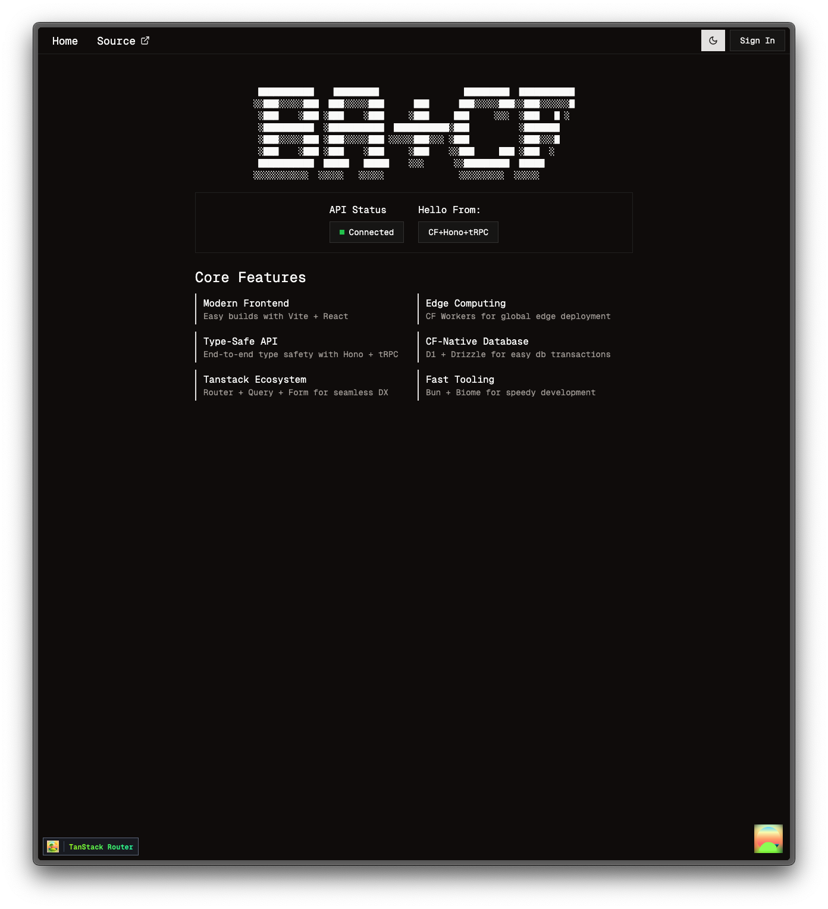

# Better-Cloud

Better-Cloud is a comprehensive full-stack application demonstrating modern web development on Cloudflare's edge platform. This production-ready application showcases real-time features, user authentication, and persistent data management using Cloudflare Workers, Durable Objects, D1, and KV, making use of Alchemy for its infrastructure-as-code configuration.

## Live Demo Features

- **🔢 Global Counter**: Real-time synchronized counter with persistent state
- **📝 Guestbook**: Traditional guestbook with user profiles and country detection  
- **👤 User Authentication**: Email OTP and social login (Google, GitHub)
- **🔄 Real-time Updates**: WebSocket connections with hibernation API
- **📊 Connection Monitoring**: Live connection count tracking

<p align="center">
  
</p>

## Table of Contents

- [Application Features](#application-features)
- [Tech Stack](#tech-stack)
- [Project Structure](#project-structure)
- [Database Schema](#database-schema)
- [Durable Objects](#durable-objects)
- [Authentication](#authentication)
- [Getting Started](#getting-started)
  - [Prerequisites](#prerequisites)
  - [Environment Variables](#environment-variables)
  - [Installation](#installation)
  - [Development](#development)
  - [Build and Preview](#build-and-preview)
  - [Deployment](#deployment)
- [License](#license)

---

## Application Features

### 🏠 Landing Page
- Real-time API health check with CF location detection
- Modern ASCII art branding
- Feature overview and navigation

### 🔢 Counter Demo (`/counter`)
- **Global State Management**: SQLite-backed persistent counter
- **Real-time Synchronization**: WebSocket updates across all users
- **Rich Metrics**: Tracks total increments, decrements, last updater
- **Connection Status**: Live WebSocket connection monitoring
- **Technical Diagrams**: Interactive flow charts explaining the architecture

### 📝 Guestbook (`/guestbook`)
- **User Messages**: Create and view community messages
- **Profile Integration**: Automatic name population from user profiles
- **Country Detection**: Cloudflare geo-location integration
- **Real-time Updates**: Instant message display without page refresh

### 👤 User Management (`/profile`)
- **Profile Settings**: Update display name and preferences
- **Session Management**: Secure authentication state
- **Social Integration**: Google and GitHub OAuth providers

### 🔐 Authentication (`/sign-in`)
- **Email OTP**: Passwordless authentication via verification codes
- **Social OAuth**: Google and GitHub provider integration
- **Session Persistence**: Secure session management with KV storage

## Tech Stack

### Frontend
- **React 19**: Latest React with concurrent features
- **TypeScript**: Full type safety throughout the application
- **Vite**: Fast development builds and hot module replacement
- **TanStack Router**: File-based routing with type-safe navigation
- **TanStack Query**: Server state management and caching
- **TanStack Form**: Type-safe form validation and handling
- **Tailwind CSS v4**: Modern utility-first styling
- **shadcn/ui**: Accessible component library
- **Sonner**: Toast notifications

### Backend & Infrastructure  
- **Cloudflare Workers**: Serverless edge computing platform
- **Hono**: Lightweight web framework for Workers
- **tRPC**: End-to-end type-safe API with client-server sync
- **Zod**: Runtime type validation and schema parsing
- **Cloudflare D1**: Distributed SQLite database
- **Drizzle ORM**: Type-safe database queries and migrations
- **Cloudflare KV**: Key-value storage for sessions and caching
- **Better Auth**: Modern authentication with email OTP and OAuth
- **Resend**: Transactional email delivery

### Real-time & State Management
- **Durable Objects**: Stateful serverless objects with strong consistency
- **WebSocket Hibernation API**: Cost-effective real-time connections
- **SQLite Storage**: ACID transactions within Durable Objects
- **Connection Pooling**: Efficient WebSocket connection management

### Development & Deployment
- **Bun**: Fast package manager and JavaScript runtime
- **Biome**: Modern linting and formatting (replaces ESLint + Prettier)
- **Alchemy**: Infrastructure-as-code for Cloudflare resources
- **Wrangler**: Cloudflare Workers development and deployment CLI

## Project Structure

```
better-cloud/
├── src/
│   ├── client/                   # React frontend application
│   │   ├── components/           # Reusable UI components
│   │   │   ├── navbar/           # Header, theme toggle, user menu
│   │   │   └── ui/               # shadcn/ui component library
│   │   ├── hooks/                # Custom React hooks
│   │   │   ├── use-counter-query.ts    # Counter state management
│   │   │   └── use-dual-websocket.ts   # WebSocket connections
│   │   ├── lib/                  # Client-side utilities
│   │   │   ├── auth-client.ts    # Better Auth client setup
│   │   │   ├── trpc-client.ts    # tRPC client configuration
│   │   │   └── theme-provider.tsx # Dark/light theme context
│   │   ├── routes/               # File-based routing (TanStack Router)
│   │   │   ├── _authLayout/      # Authentication pages
│   │   │   │   └── sign-in.tsx   # Email OTP and social login
│   │   │   ├── _protectedLayout/ # Authenticated user pages
│   │   │   │   ├── counter.tsx   # Global counter demo
│   │   │   │   ├── guestbook.tsx # Community guestbook
│   │   │   │   └── profile.tsx   # User profile management
│   │   │   ├── __root.tsx        # Root layout component
│   │   │   └── index.tsx         # Landing page
│   │   └── routeTree.gen.ts      # Auto-generated route definitions
│   │
│   └── server/                   # Cloudflare Workers backend
│       ├── db/                   # Database layer
│       │   ├── schema/           # Drizzle ORM schemas
│       │   │   ├── auth.ts       # Authentication tables
│       │   │   └── guestbook.ts  # Guestbook messages
│       │   ├── migrations/       # Database migration files
│       │   └── index.ts          # Database connection setup
│       ├── durable-objects/      # Stateful serverless objects
│       │   ├── counter.ts        # Global counter with SQLite
│       │   └── connection-counter.ts # WebSocket connection tracking
│       ├── lib/                  # Server-side utilities
│       │   ├── auth.ts           # Better Auth configuration
│       │   ├── context.ts        # tRPC context setup
│       │   └── types.ts          # Shared TypeScript types
│       ├── routers/              # tRPC API routes
│       │   ├── counter.ts        # Counter operations
│       │   ├── guestbook.ts      # Guestbook CRUD
│       │   ├── user.ts           # User profile management
│       │   └── index.ts          # Router composition
│       └── index.ts              # Worker entry point
│
├── types/                        # Global TypeScript definitions
│   ├── env.d.ts                  # Alchemy augmented env types
│   └── vite.d.ts                 # Vite types
├── public/                       # Static assets
├── alchemy.run.ts                # Infrastructure-as-code (Alchemy)
├── vite.config.ts                # Vite configuration
├── drizzle.config.ts             # Database migration config
├── biome.json                    # Linting and formatting rules
└── package.json                  # Dependencies and scripts
```

## Database

The application uses **Cloudflare D1** (distributed SQLite) with **Drizzle ORM** for type-safe database operations.

### Database Commands

| Command | Description |
|---------|-------------|
| `bun db:generate` | Generate migration files from schema changes |
| `bun db:push` | Push schema changes directly (development only) |
| `bun db:migrate` | Apply pending migrations to database |
| `bun db:studio` | Launch Drizzle Studio for local database |
| `bun db:studio:prod` | Launch Drizzle Studio for production database |

## Durable Objects

Durable Objects provide stateful, globally-consistent serverless computing with persistent storage and real-time WebSocket capabilities.

### Counter Durable Object (`counter.ts`)

**State Management**
- Persistent counter value with increment/decrement operations  
- Comprehensive metrics: total increments, decrements, last updater, timestamps
- SQLite-backed storage with ACID transaction guarantees
- Automatic state restoration after hibernation

**WebSocket Features**  
- Real-time updates broadcast to all connected clients
- Hibernation API for cost-effective WebSocket connections
- Support for up to 32,768 concurrent connections per object
- Ping/pong keepalive and connection health monitoring

**API Endpoints**
- `GET /` - Retrieve current counter state and metrics
- `POST /increment` - Increment counter with optional amount and username  
- `POST /decrement` - Decrement counter with optional amount and username
- `WebSocket` - Real-time counter updates and connection management

### Connection Counter Durable Object (`connection-counter.ts`)

**Connection Tracking**
- Real-time monitoring of active WebSocket connections
- Automatic count updates when clients connect/disconnect  
- Broadcast connection count changes to all subscribers
- Hibernation-optimized for zero idle costs

**Use Cases**
- Live user count display
- Connection health monitoring  
- Real-time presence indicators
- System load monitoring

### Architecture Benefits

**Cost Efficiency**
- Hibernation eliminates memory charges during idle periods
- Pay only for active compute time and storage
- Automatic wake-up on incoming requests (sub-millisecond latency)

**Strong Consistency** 
- Single object instance processes all operations sequentially
- No race conditions or eventual consistency issues
- ACID transactions within SQLite storage

**Global Performance**
- Deployed to Cloudflare's global edge network
- Automatic migration to optimal data center locations  
- Sub-100ms response times worldwide

## Authentication

**Better Auth** provides secure, modern authentication with multiple sign-in methods and session management.

### Authentication Methods

**Email OTP (One-Time Password)**
- Passwordless authentication via email verification codes
- 6-digit OTP codes sent via Resend email service  
- Configurable expiry times and rate limiting
- Development mode logs codes to console (no email sent)

**Social OAuth Providers**
- **Google**: OAuth 2.0 with Google Account integration
- **GitHub**: OAuth 2.0 with GitHub profile access
- Automatic profile creation and linking
- Secure token management with refresh capabilities

### Session Management

**Storage Architecture**
- **Primary Storage**: User accounts and sessions in Cloudflare D1 database
- **Secondary Storage**: Session caching in Cloudflare KV for fast access
- **Cross-subdomain Support**: Shared sessions across `*.better-cloud.dev`

**Security Features**  
- Secure HTTP-only cookies with SameSite protection
- Rate limiting on authentication attempts
- IP address and user agent tracking
- Automatic session expiry and cleanup

### Authentication Flow

1. **Sign In**: User enters email or clicks social provider
2. **Verification**: OTP sent via email OR OAuth redirect to provider
3. **Account Creation**: New users automatically get profiles created  
4. **Session Establishment**: Secure session created with KV caching
5. **Profile Access**: User redirected to protected routes with full access

### Configuration

All authentication endpoints are available under `/auth/*`:
- `/auth/sign-in/email` - Email OTP initiation
- `/auth/sign-in/google` - Google OAuth redirect
- `/auth/sign-in/github` - GitHub OAuth redirect
- `/auth/sign-out` - Session termination
- `/auth/callback/*` - OAuth return endpoints

## Getting Started

### Prerequisites

- **Bun v1.2+** - Fast JavaScript runtime and package manager
- **Node.js v18+** - Alternative runtime (if not using Bun)
- **Cloudflare Account** - For Workers, D1, KV, and domain management
- **Wrangler CLI** - Cloudflare development tool: `npm install -g wrangler`

### Environment Setup

**Local Development Environment**
Create `.env.dev.example` → `.env.dev` with:
```env
VITE_CLIENT_URL=http://localhost:5173
VITE_SERVER_URL=http://localhost:8787
TRUSTED_ORIGIN=http://localhost:5173
BETTER_AUTH_URL=http://localhost:8787
BETTER_AUTH_SECRET=your-secret-key
GOOGLE_CLIENT_ID=your-google-oauth-id
GOOGLE_CLIENT_SECRET=your-google-oauth-secret
GITHUB_CLIENT_ID=your-github-oauth-id
GITHUB_CLIENT_SECRET=your-github-oauth-secret
RESEND_API_KEY=your-resend-key
```

**Production Environment**  
Create `.env.prod.example` → `.env.prod` with production URLs and secrets.

### Installation

```bash
# Install dependencies
bun install

# Generate database migrations (if needed)
bun db:generate

# Push database schema to D1
bun db:push
```

### Development

**Dual Server Setup** (Required)
```bash
# Terminal 1: Frontend development server  
bun dev              # → http://localhost:5173

# Terminal 2: Workers API server
bun cf:dev           # → http://localhost:8787
```

**Why Two Servers?**
- **Frontend (Vite)**: Hot module replacement, React dev tools, fast builds
- **Backend (Workers)**: Durable Objects, WebSocket connections, authentication
- **Note**: Social OAuth requires the Workers server for proper callback handling

**Development Commands**
```bash
bun check            # Lint and format code with Biome  
bun typecheck        # TypeScript type checking
bun db:studio        # Launch database browser interface
```

### Build and Preview

```bash
# Build for production
bun build

# Preview production build locally  
bun preview          # → http://localhost:4173
```

### Deployment

**Option 1: Alchemy (Recommended)**
```bash
# Deploy with infrastructure-as-code
bun a:dev            # Launch alchemy dev server
bun a:deploy         # Deploy to production  
```

**Option 2: Direct Wrangler**
```bash
# Deploy directly to Cloudflare
bunx wrangler deploy
```

### Infrastructure Management

**Alchemy Configuration** (`alchemy.run.ts`)
- **Declarative Resources**: D1 database, KV namespaces, Durable Objects
- **Custom Domains**: Automatic DNS and SSL certificate management
- **Environment Management**: Separate dev/prod configurations  
- **Resource Adoption**: Import existing Cloudflare resources

**Cloudflare Resources Created:**
- **Worker**: Main application server
- **D1 Database**: User data and guestbook messages
- **KV Namespace**: Session storage and caching
- **Durable Objects**: Counter and connection tracking
- **Custom Domains**: Production domain with SSL

## License

MIT License
